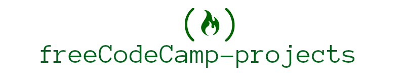

> 🦄 30 "Free Code Camp Projects"

---

  
 🦄 Front End Development Projects(<strong>10</strong>)

  

  * [Tribute Page](https://github.com/ragmha/tribute)
  * Personal Portfolio
  * Random Quote Machine
  * Local Weather
  * Wikipedia Viewer
  * Twitch.tv JSON API
  * Calculator
  * Pomodoro Clock
  * Tic Tac Toe Game
  * Simon Game

  

---

  
 🦄 React Projects (<strong>5</strong>)

  

  * Markdown Previewer
  * Camper Leaderboard
  * Recipe Box
  * Game of Life
  * Roguelike Dungeon Crawler Game

  

---

  
 🦄 Data Visualization Projects (<strong>5</strong>)

  

  * Visualize Data with a Bar Chart
  * Visualize Data with a Scatterplot Graph
  * Visualize Data with a Heat Map
  * Show National Contiguity with a Force Directed Graph
  * Map Data Across the Globe

  

---

  
 🦄 API Projects (<strong>5</strong>)

  

  * Timestamp Microservice
  * Request Header Parser Microservice
  * URL Shortener Microservice
  * Image Search Abstraction Layer
  * File Metadata Microservice

  

---

  
 🦄 Dynamic Web Application Projects (<strong>5</strong>)

  

  * Voting App
  * Nightlife Coordination App
  * Chart the Stock Market
  * Manage a Book Trading Club
  * Pinterest Clone

  

---

## Reference
[Free Code Camp](https://www.freecodecamp.com/)

## License
[MIT](./license) © [Raghib Hasan](http://raghibm.com/)
